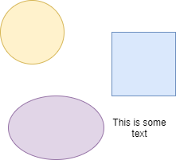

# Example

Hello!

This is how code can be inserted:

    {
        "SimulationState" : "running",
        "Name" : "Name of the simulation",
        "Description" : "Longer description about the simulation"
    }

This thing supports even tables:

| Field | Type | Multiplicity | Explanation |
| ---- | ---- | ---- | ---- |
| All fields from [AbstractMessage](subsub1.md) |  |  | Fields from the "abstract base class" |
| SimulationState | String | 1 (REQUIRED) | Simulation state, either: "running" or "stopped" |
| Name | String | 0..1 (OPTIONAL) | A human friendly name for the simulation. |
| Description | String | 0..1 (OPTIONAL) | A longer description of the simulation run meant for humans. |

